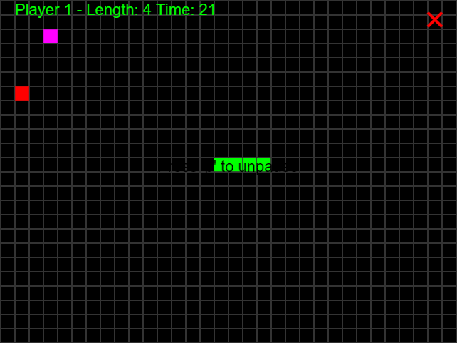

## Serpent Works - Проектна по Визуело Програмирање 2018

### Направено од:
 + ##### Филип Маркоски 161528
 + ##### Кристијан Ангеловски 165025

###Играта е поставена на следниов линк:
####https://asocial-setting.000webhostapp.com

### Опис на проблемот, играта
Играта Serpent Works е базирана на класичната добро-позната аркадна игра Snake. Инструкции за играта се понудени и во самата игра при кликање на копчето Instructions кое се наоѓа во менито, но исто така ќе ги образложиме и тука.  
Корисникот контролира квадратче или објект на таблата за играње која е дефинирана од конечен број полиња. Змијата на играчот смее да се движи само на таблата и доколку престапи пример на левиот крај таа се телепортира на десниот крај, што значи дека таблата е циклична. Играчот ја контролира само главата на змијата. Змијата има одредена почетна должина, односно опашка која константно ја следи главата. Дозволени потези на змијата се Горе, Доле, Лево, Десно, но не е дозволено во одење во насока на сопствената опашка на змијата. Во секој миг на таблата треба да се појави друго квадратче или објект (можеби и повеќе од едно) што претставуваат храна која змијата цели да ја изеде. Во случај кога главата на змијата и едно од јадењата се наоѓаат на иста позиција тогаш змијата расте во должина, а јадењето го снемува бидејќи е изедено. Играта завршува кога должината на играта е еднаква на СИТЕ полиња од таблата. Како што може да замислите, големината на таблата директно корелира со тежината на играта. При изработка на овој проект ние, членовите во тимот, наидовме на алгоритми на вештачка интелигенција кои употребуваат длабоки невронски мрежи. Ова се алгоритми кои се свесни за одредени стратегии како одење горе-доле со змијата со цел да се компактира опашката и да не пречи при ловот на храната. Ние се обидовме да создадеме алгоритам на вештачка интелигенција, поконректно два-три, од кој најглавниот е информираното пребраување А*, што е многу познат алгоритам кој користи хевристика. Детали за А* алгоритмот ќе бидат образложени подоле.

Играта нуди и можност за двајца играчи да играат, каде за разлика од често позната варијација каде играат еден против еден, тука играат во тим, што значи дека успех на едниот е успех за двајцата. Тука играчите треба да бидат добро координирани меѓу себе. Во Serpent Works исто така освен обичната храна која после пет јадења ја забрзува змијата исто така има и специјална храна која дава различни ефекти врз змијата ('big', 'small', 'color') како што се наведени во заградите првиот додава +2 должина на змијата за разлика од +1 што дава обичната храна, второто ја намалува должината на змијата за 10% што служи како казна и третото ги менува боите на играта.

Последно како што беше спомнато играта е понудена и на вештачата интелигенција, каде што таа е уствари играч и ја контролира змијата.
Во менито можат дополнително да се најдат табели кои со употреба на десеријализација прикажуваат кој од играчите има најдобар резултат постигнато. Ваков scoreboard има за секоја варијација понудена од играта, Single Player and Two Player.

Играта е веб-базирана и е програмирана во JavaScript (што веројатно беше лош избор). Вистинскиот извршен код е запишан во програмскиот јазик JavaScript, но тој е создаден од transpiling на TypeScript код. Употребивме TypeScript бидејќи тоа е барем еден начин да се добие објекно-ориентиран пристап на решавање на проблемот како во другите јазици како C#. 

### Изглед и дизајн на играта
Изгледот и дизајнот на играта е создаден статички и динамички со употреба на HTML, CSS и JavaScript. Главната рамка во која се прикажува играта ја нарекуваме canvas, преведено во платно (според translate.google.com) и таа се наоѓа во container што е <div> HTML element. При секоја промена на распоредот на играта платното се менува. Во сликите подоле можете да ги погледнете визулените репрезентации на мените, уредувањата(settings), самата игра со тавелата итн.

#### Menu


#### Settings


#### Game Over


#### HighScores


А* Single Player
  

Human Single Player Hard Black


Human Single Player Hard Wheat                 

  
Human AI Two Player Purple


Линкови во случај да не се прикажуваат сликите тука погоре:

+ Menu - https://imgur.com/6tBIxOa 
+ Settings - https://imgur.com/5yoqQNl 
+ Game Over - https://imgur.com/maDJ7jg
+ HighScores - https://imgur.com/0nTJpjh
+ А* Single Player - https://imgur.com/goPEvSb
+ Human Single Player Hard Black - https://imgur.com/Kp8OwNn 
+ Human Single Player Hard Wheat - https://imgur.com/SpBlkLY
+ Human AI Two Player Purple - https://imgur.com/8pwkaIv 


### Што научивме?
Овој проект по предметот Визуелно Програмирање во 2018та година нѐ научи на многу работи кои беа надвор од опсегот на самиот предмет. Како прво, требаше да стекнеме интимно познавање на програмскиот јазик JavaScript и дополнително со цел да си помогнеме во концептуализицијата на апстракцијата на проблемот и TypeScript кој е преведен во готов JavaScript, ова не е компајлирање, туку е транспајлирање. 
При согледување во тоа дека во JavaScript отсуствуваат готови податочни структури како Set, HashMap etc. што ги има буквално во сите модерни познати јазици, а ги има и во JavaScript, само нормално не работат за објекти туку работат само со примитивни типови како интигери и стрингови. 
Податочните структури покрај тоа што некои ги најдовме на интернет по конкретно од следниов линк, сепак често пати требаше да се менува кодот бидејќи едноставно не работеа воопшто како што би се очекувало. На крај завршивме со О(n) итерирање на цела листа барајќи дали дадениот елемент е еднаков со некој од нив. 
Покрај стекнатите разбирање за податочните структури како Set, Priority Queue, Stack, Queue, Graph итн., разбразвме некои недиректно забележливи детали на јазикот пример 
 ```javascript
 for(let item in list);
 ```
 
 во променливата item се враќа уствари ИНДЕКСОТ на објектот во листата, за да го добиеме самиот објект треба да користиме 
```javascript
for(let item of list);
```
Друг пример би бил следниов 
 ```javascript
a.push.apply(a, b)
``` 
 каде а и б се листи, оваа линија код резултира во тоа сите елементи од б листата да се додадат во а листата. Има многу други примери од кои последни ќе ги спомнеме 
```javascript
list.indexOf(item) !== -1
``` 
и 
```javascript
list.splice(index, 1)
```
 итн.
 
Научивме да најдеме free hosting web server на кој направивме просто REST API запишано во .php кое уствари служи за серијализиција на scoreboards.
Научивме за неинформирано и информирано пребарување што се типови на пребарување на вештачка интелигенција, поконкретно за Breadth First Search, Depth First Search, Best First Search, Greedy Best First Search и A*.
Научивме како да го поставиме проблемот за тоа да можеме да извршиме едно од пребарувањата врз него.
Научивме за многу други работи почнувај со менаџмент на релациона база до ECMAScript 6.

### Опис на решението
Најглавни класи се можеби `Menu, Board and Snake` како што сугестираат имињата мени класата е воглавно задолжена за визуелната репрезентација на менито како и некои одредени функционалност во `Settings` што се промена на резолуција, промена на тежина на играта и промена на моменталната музика. 

`Board` класата е задолжена за визуелната репрезентација на таблата, змиите, лабелите за досегашни постигнувања, exit копчето итн. и исто така употребува инстанци од класата `Snake` која пак користи инстанци од класите `Traversal, Problem, ProblemNode, etc.` за да добие потег кој наредно ќе може да го изврши, овие класи уствари ја претставуваат вештачката интелигенција присутна во проектот . 

Класите и структурите кои се уствари класи кои помагаат со тоа што нудат одредена функционалност или придонес на апстракција се `Point` класата и пример `PriorityQueue` кое се употребува во A* алгоритмот. Податоците се најчесто чувани во низи бидејќи тоа е најмоќното нешто во JavaScript.

Проектот е направен во 2018 година и од прилика содржи 12000 илјади линии код. JavaScript беше непогоден јазик за употреба особено во врска на сериализација, но воглавно проектот ги нуди следниве функционалности:

## Функционалности

+ Игра за еден играч човек
+ Демонстрација на еден играш раковеден од breath first search алгоритмот
+ Демонстрација на еден играш раковеден од А* алгоритмот
+ Игра за двајца играчи луѓе
+ Игра за двајца играчи, еден човек и еден бот
+ Селекција меѓу три нивоа Easy, Normal and Hard
+ Интрукции
+ Селекција и промена на трите нивоа Easy, Normal and Hard
+ Промена на песната која се слуша
+ Старување на песната
+ Паузирање на песната
+ Излез од апликацијата

### Опис на функцијата `animate()` која припаѓа во `Board` класата

Прво погледнете ја функцијата која е веројатно една од најглавните функции во целосниот проект и служи за самото движење на змијата за која ќе следува кратко објаснување.

```javascript
animate(ctx, playerType, direction, snake: Snake, interval, container, menu) {
    this.draw(ctx);
    this.milis += interval;

    if (!Point.isInList(snake.head, snake.trail)) {
        snake.trail.push(snake.head);
        while (snake.trail.length > snake.length) {
            snake.trail.shift();
        }

        snake.draw(ctx, this.block_size, this.ten_percent);
        this.drawFood(ctx, this.food_point, this.FOOD_COLOR);
        this.drawFood(ctx, this.special_food_point, this.SPECIAL_FOOD_COLOR);

        if (playerType === "human") {
            snake.head = snake.move(direction);
        } else {
            // ai_snake
            if (snake.trail.length === snake.length) {
                snake.head = snake.get_next_move(this.food_point);
            } else {
                snake.head = snake.move(direction);
            }
        }

        if (snake.head.equals(this.food_point)) {
            // this.has_point = false;
            this.food_point = this.getRandomPointNotInList(snake.trail);
            snake.length += 1;
        }
        else if (snake.head.equals(this.special_food_point)) {
            this.special_food_point = this.getRandomPointNotInList(snake.trail);

            switch (this.special_food_type) {
                case "big": {
                    snake.length += 2;
                    break;
                }

                case "small": {
                    snake.length -= Math.round(snake.length / 10);
                    break;
                }

                case "color": {
                    if (this.BLOCK_COLOR === "white") {
                        this.BOTTOM_COLOR = "white";
                        this.BLOCK_COLOR = "black";
                        snake.color = "lime"
                    } else if (this.BLOCK_COLOR === "black") {
                        this.BOTTOM_COLOR = "tomato";
                        this.BLOCK_COLOR = "purple";
                        snake.color = "orange"
                    } else if (this.BLOCK_COLOR === "purple") {
                        this.BOTTOM_COLOR = "pink";
                        this.BLOCK_COLOR = "wheat";
                        snake.color = "whiteSmoke"
                    } else {
                        this.BOTTOM_COLOR = "gray";
                        this.BLOCK_COLOR = "white";
                        snake.color = "blue";
                    }
                    break;
                }
            }

            this.special_food_type = this.special_food_types[Math.floor(Math.random() * (this.special_food_types.length))];
        }
    } else {
        // get name
        this.clearAllCycles();

        let current_milis = Math.round(this.milis / 1000);
        let current_difficulty = this.difficulty;

        this.getName(this.canvas, ctx, "Enter player's name: ",
            function (name) {
                let url: string = "https://asocial-setting.000webhostapp.com/scores.php";
                console.log(name.toString(), snake.length.toString(), current_milis.toString(), current_difficulty);
                let data = {
                    type: 'sp',
                    name: name.toString(),
                    score: snake.length.toString(),
                    time: current_milis.toString(),
                    difficulty: current_difficulty.toString()
                };
                $.post(url, data, (response) => {
                    console.log(response);
                });

                console.log(name);
                menu.ShowMenu(container);
            });

    }
    ctx.fillStyle = snake.color;
    ctx.fillText("Player 1 - Length: " + snake.length + " Time: " + Math.floor(this.milis / 1000), this.block_size, this.block_size);
}
```

#### Објаснувањето на функцијата `animate()`
Оваа функција е за single player, за two player mode има друга функција `animateTwoPlayer()` која е е иста како оваа функција, но одредени работи се повторуваат и за втората змија.

Најпрвата линија на код извршена при влез на функцијата `animate()` е`this.draw(ctx);` која е функција задолжена за исртување на самата табела со квадратчиња итн. Битно е да се наведе дека функцијата `animate()` е повикувана на одреден интервал со помош на JavaScript функцијата `setInterval(func_ref, interval)`. Имајќи го тоа во ум, можете да разберете дека втората линија код `this.milis += interval;` би претставувала регуларна и предвидливо инкрементирање на променливата што е уствари часовникот на самата игра и е употребена во последната линија код, внатре во `ctx.fillText()`. 

Секој пат кога е повикана функцијата `animate()` се тестира дали главата на змијата е во колизија со својата опашка. Доколку не е во колизија, на опашката и се додава сопствената глава. Ова сѐ има смисла доколку размислувате на тоа дека `animate()` е повикувана како што кажавме на одреден интервал. Вака можете да разберете дека со додавање на главата константо на опашката на змијата се симулира движињето на змијата, а за да не испадне дека змијата прекумерно вака ќе се зголемува служи наредниот `while` кој што ја запазува точната должина на змијата со тоа што `snake.trail.shift()` служи за исфрлање на последниот елемент од низата која е уствари опашката на змијата.

Наредните линии служат за исртување на змијата, храната и специјалната храна. После тоа следува `if` кој прашува дали играчот е човек доколку е ќе мрда според насоката кој човекот ја внел преку `event listener` кој пази за кликови на стрелките, а ако не е човек се потпира на `get_next_move()` за да се одлучи наредниот потек на змијата.

После тоа следува решението на прашањето „Што да се случи ако главата на змија ја изеде храната? и исто така и специјалната храна“.

За крај, има `else` што е уствари постигнат доколку змијата постигне колизија со својата опашка и тука се стопира циклусот/часовникот со `clearAllCycles()` и се повикува `getName()` која служи за можноста човекот да си го внесе своето име и да го серијализира и зачува во базата на податоци лоцирана на web-server-от, поконкретно во MySQL база и за на крај на корисникот му е прикажано менито. 

Дополнително, последните линии со `ctx.fillText` се уствари оние линии кои ја постигнуваат визулената репрезентација на досегашните постигнувања на корисникот кои се рефрешираат поради `setInterval` како што спомнавме претходно. 


2018, Скопје